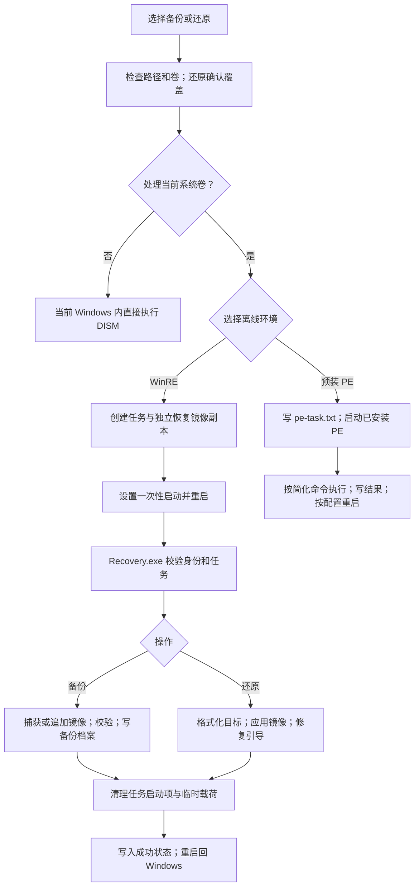

# 备份、还原完整流程（按当前代码梳理）

- 记录时间：2026-09-30 19:25，亚洲/新加坡。
- 执笔模型：GPT-6。
- 代码基线：`398a3fb`，v1.9.9；本轮仅整理文档及同步版本为 v2.0.0（按满十进位规则），不改变执行逻辑。
- 证据边界：本轮读取当前代码与已有测试记录，没有操作虚拟机、修改启动项、格式化分区或重跑备份还原。历史实测与本轮检查分别列示。

## 1. 先区分三个入口

产品备份的是选定分区中的文件，使用 WIM（Windows 映像格式）；不是整盘逐扇区克隆，不重建分区表，也不单独把 EFI 系统分区、微软保留分区和恢复分区全部打包。

| 用户选择 | 实际分流 | 关键边界 |
|---|---|---|
| 备份当前正在运行的 Windows（视窗系统）卷 | 选择进入 WinRE（Windows 恢复环境）或预装 PE（预安装环境） | 当前系统卷必须离线处理 |
| 还原当前正在运行的系统卷 | 同上；还原前显示覆盖确认 | 程序及任务目录必须在另一个分区 |
| 备份/还原非当前系统卷，包括未运行的第二系统 | 图形界面直接调用在线执行函数，不重启 | 与完整 WinRE 任务链的保护及收尾不同 |
| 新增第二系统 | `create-secondary` → `prepare` → WinRE 任务链 | 可选功能，不是普通还原的前提；保留原默认启动项 |

代码按 `%SystemDrive%` 判断“当前系统”，不是按是否含有 Windows 文件夹判断。命令行直接执行 `prepare` 走完整任务准备路径，不经过图形界面的在线分流。



DISM（部署映像服务和管理）负责文件捕获/应用。主程序与 `Recovery.exe` 是同源二进制的两个文件名；当前载荷生成会优先核对正在运行的程序，避免把旁边的旧 `Recovery.exe` 注入恢复镜像。

## 2. 完整 WinRE 链路的共用准备

### 2.1 选择与前置校验

1. 备份选择源卷、镜像绝对路径、索引名称、压缩/不压缩及保留索引数；还原选择 WIM、索引与目标卷。
2. 还原先确认目标会被覆盖。程序目录与目标同分区时拒绝，不自动搬移程序。
3. `prepare` 要求管理员权限，读取卷身份；源卷须为非保留 NTFS（新技术文件系统）分区。
4. 检查源卷、镜像卷及还原目标的 BitLocker（驱动器加密）状态；无法确认未加密时拒绝，不自动解密。
5. 排除 EFI/MSR/Recovery 等保留分区作为程序、镜像或还原目标；镜像不能放在备份源或还原目标上。
6. 单系统还原要求源与目标是同一分区；新增第二系统要求二者不同。
7. 镜像卷不能等于注册 WinRE 所在卷。备份允许程序在该宿主卷；其他操作仍限制程序位置。这是当前代码规则，并非所有卷角色一律互斥。
8. 备份空间预估为源卷已用空间 + 2 GiB；追加既有 WIM 时，再预留原 WIM 候选副本空间。程序卷另需约两份 WinRE 镜像 + 256 MiB。
9. 还原用 DISM 检查所选索引；有备份档案时，目标容量至少满足档案要求且不小于原源分区。缺档案时此项容量预检不完整，不能据此保证目标一定装得下。

内部身份包括磁盘/分区 GUID（全局唯一标识符）、卷 GUID、偏移、长度、类型及卷序列号。桌面显示的盘符只是定位线索，恢复环境会重新匹配。

### 2.2 创建任务与启动保护副本

1. 清理较老终态任务的大文件；默认保留最近 3 个终态任务，未完成、记录损坏或仍有挂载内容的任务跳过。
2. 创建 `tasks/<任务编号>/`，写入 `task.json` 和 `status.json`，状态为 `prepared`。
3. 导出 BCD（启动配置数据），保存 EFI 上 BCD 文件的原始副本及哈希，用于引导修复失败后的恢复尝试。
4. 从系统注册位置读取原版 `Winre.wim`，分别复制到任务的 `original/` 与 `stage/`。
5. 准备 `Recovery.exe`、`RecoveryTask.env`、不可变任务副本与 `winpeshl.ini`。清单记录载荷和配置的 SHA-256（安全散列算法）摘要。

这里的 BCD 副本只保护启动配置，不是还原前目标分区的数据备份。格式化之后，不能靠恢复 BCD 找回原文件。

### 2.3 建独立启动项、注入副本、最后设置一次性启动

1. 把干净 WinRE 副本复制到镜像卷的 `\BackupRestoreRE\Winre.wim`，复制可用的 `boot.sdi`。
2. 从可用 WinRE 模板复制一对临时 BCD 对象，指向镜像卷上的恢复载荷，回读核对。
3. 在任务目录挂载 `stage/Winre.wim`，注入程序与任务配置，提交并卸载镜像。
4. 注入后的 WIM 覆盖镜像卷上的临时恢复副本，更新 `boot-entry.json` 内的实际载荷哈希。
5. 设置 `bootsequence`（一次性启动序列），回读核对，落盘 `boot-requested`，然后请求重启。

当前路径**不向注册 WinRE 注入载荷，不执行 `reagentc /boottore`，终态也不再写回原件或重注册**。旧迁出/迁回和“捕获前换干净件”文档属于历史方案。

“注册位置只读”指任务载荷准备机制；还原如果格式化了 WinRE 所在目标卷，那个卷上的 WinRE 文件仍会被镜像内容替换。当前程序不额外保证任意外来镜像的恢复环境注册有效，需还原后验证。

`prepare --no-reboot` 会提前返回，不设置一次性启动、不重启；但此前已创建 BCD 对象、复制/挂载 WIM。它不是无副作用预览，测试时仍受快照约束。

### 2.4 恢复环境接管

引导器把恢复 WIM 加载到内存盘，`winpeshl.ini` 直接启动：

```text
%SYSTEMROOT%\System32\Recovery.exe recover-env %SYSTEMROOT%\System32\RecoveryTask.env
```

恢复程序先显示进度窗口，再定位任务卷；核对任务编号、操作、阶段、环境配置和载荷清单，以及正在运行的程序哈希。随后重新定位源卷、镜像卷、目标卷与所需 EFI 卷，并核对稳定身份。

已格式化阶段允许源/目标的卷序列号变化，但继续核对物理分区身份。终态任务拒绝再次执行。

## 3. 完整备份流程

| 顺序 | 实际动作 | 产物/状态 |
|---|---|---|
| 1 | 完成上述准备、重启、卷与载荷校验 | `prepared → boot-requested → recovery-started → preflight` |
| 2 | 生成统一捕获排除表 | 排除回收站、临时目录、更新下载、浏览器缓存、`Windows.old`、Parallels 卷根占位文件等 |
| 3 | 镜像不存在时捕获到 `<镜像>.partial` | `capturing`；`/Capture-Image /CheckIntegrity` |
| 4 | 镜像存在时先复制候选 WIM，再追加新索引 | `<镜像>.<任务编号>.append-candidate.wim`；原件暂时保留 |
| 5 | 检查首次索引为 1，或追加后恰好多一个索引，再替换正式镜像 | 当前正式 WIM |
| 6 | 计算整包 SHA-256，写每个索引的备份档案 | `<镜像>.index-N.metadata.json` |
| 7 | 若设置保留最近 N 个索引，删除最旧索引并重排档案 | 再计算最终 WIM 大小/哈希，同步剩余档案 |
| 8 | 清理本任务启动项和镜像卷临时载荷，写成功并重启 | `success`，回 Windows |

压缩对应 `/Compress:fast`，不压缩对应 `/Compress:none`；仅首次创建生效，追加沿用原 WIM 的压缩设置。保留数为 0/未设置时不清理旧索引。

备份档案记录整包大小/哈希、索引号、源分区身份、容量、系统信息、版本和耗时。**一个 WIM 内多个索引共享整包哈希**，不是每个索引各自有独立的文件哈希。

候选替换、档案更新和旧索引删除并非一个整体原子事务；不能把主路径成功推导为任意断电时刻都已受保护。

备份通常无需执行 BCDBoot（启动文件修复工具）；它主要用于系统还原后的引导修复。备份的启动收尾是删除本任务临时启动配置。

## 4. 完整还原流程

1. **读镜像**：界面优先用旁边的备份档案显示索引；没有档案才调用 DISM。快速显示不是完整性校验，档案也可能过时。
2. **确认目标与覆盖**：选定索引和目标，确认目标内容将被覆盖；检查程序、镜像不在目标分区。
3. **准备及进入 WinRE**：执行第 2 节共用流程。
4. **最后校验**：恢复程序核对镜像实际大小和整包哈希，与任务/备份档案比较；检查容量，再让 DISM 读取 WIM。
5. **格式化**：先落盘 `target-erased`，再按已验证的磁盘号和分区号快速格式化 NTFS；格式化后复核 GUID、分区类型、偏移与长度。
6. **应用镜像**：`DISM /Apply-Image /Index:<所选索引>` 写入目标；命令成功后落盘 `image-applied`。
7. **修复引导**：如果目标存在 `Windows\System32\config\SYSTEM`，调用 `BCDBoot <目标>\Windows /s <EFI> /f UEFI /v`，检查引导文件及 BCD 目标。
8. **可选第二系统**：额外使用 `/addlast`，设置新菜单名称，并恢复原默认项/顺序等主启动配置；普通还原不建立第二系统。
9. **数据卷分支**：没有 SYSTEM 注册表文件时跳过 BCDBoot，作为数据卷路径继续完成。因此 `success` 也不能单独证明“这是可启动的系统镜像”。
10. **清理与返回**：清掉本任务一次性启动，删除临时 BCD 对象并回读确认，再按卷身份删除 `BackupRestoreRE` 临时目录。清理成功才写 `success`，随后请求重启。

`target-erased` 是“已经跨入允许擦除阶段”，可能在格式化开始前已写入；`boot-repaired` 也在 BCDBoot 前写入，以便失败时识别回滚边界。不能只看这两个名称就断言动作完成。

`success` 在重启请求前落盘。真正的系统还原验收还需要成功回到正确的 Windows、核对文件/应用状态和引导配置。

## 5. 当前校验选项的真实覆盖范围

| 场景 | 图形界面 | 管理员准备 | WinRE 执行 |
|---|---|---|---|
| 不勾严格哈希，有档案 | 比实际文件大小与档案大小 | 比大小；任务复用档案哈希 | **仍无条件比实际大小并计算整包哈希** |
| 勾严格哈希，有档案 | 在界面线程计算哈希 | 再计算一次哈希 | 仍计算哈希 |
| 档案不匹配，用户确认继续 | 设置 `--force-restore-hash` | 可放行档案不匹配 | 任务可能仍保存旧档案哈希，恢复阶段继续拒绝 |
| 无档案，用户确认继续 | 显示缺档案提示 | 为任务计算当前镜像哈希 | 校验与准备时是否一致，不等于证明原始镜像可信/可启动 |

结论：v1.9.9 的“默认仅比大小”只实现了部分阶段；“强制继续”也未成为贯穿整个任务的策略。严格模式还存在前端/准备/执行重复读整包的问题。以上是本轮代码核对结论，未以新一轮实机测试复现。

定位：`native_gui.rs::create_task`、`windows_prepare.rs::validate_operation_inputs / prepare_task / write_recovery_env`、`main.rs::recover_windows`、`backuprestore-core::verify_image_file`。

## 6. 在线与预装 PE 路径不能等同完整任务链

| 能力 | 完整 WinRE 任务 | 界面在线执行 | 界面调度预装 PE |
|---|---|---|---|
| 执行入口 | `recover-env → recover_windows` | `execute_online` | `pe_task_execute → execute_pe_task_line` |
| 持久任务状态机 | 有 | 未接入 | 未接入，仅文本配置/结果 |
| 备份追加保护 | 候选副本验证后替换 | 直接追加正式 WIM | 捕获分支按单镜像实现，不接追加/保留策略 |
| 索引、压缩、保留数 | 完整任务参数 | 使用界面参数 | 调度不传所选索引/压缩；还原固定 `/Index:1` |
| 备份档案 | 写入并同步哈希 | 执行函数不生成/同步档案 | 自动任务捕获函数不生成/同步档案 |
| 还原前格式化 | 有 | 无，直接应用镜像 | 自动调度只写 restore 和 reboot，无格式化 |
| 系统引导修复 | 检查 SYSTEM 后执行并验证 | 无 | 自动调度未安排此步骤 |
| 断电续跑 | 按任务阶段重试，存在第 7 节边界 | 未接入 | `.done` 标记代替完整状态机 |
| 动作失败后返回 | 标失败，不走正常成功重启 | 返回命令退出码与输出 | 后续 `reboot` 行不以备份/还原成功为条件 |

在线还原是“把镜像内容应用到现有文件系统”；镜像中没有的旧文件可能仍在目标上，不能保证回到干净备份点。在线捕获也没有接入 VSS（卷影复制服务）快照，源数据仍有其他程序写入时不保证一致时点。

预装 PE 任务写在 ESP（EFI 系统分区）上的 `pe-task.txt`，设置现成 PE 启动项；启动后执行文本命令、写 `pe-task-result.txt`，再把配置改名为 `.done`。该通道只传盘符和路径，不带完整任务的稳定卷身份；暂不支持带空格镜像路径。

这些差异会改变用户选项和“还原”的含义，应优先统一执行内核。当前界面把 PE 标为推荐，不代表它已具备完整 WinRE 任务链的能力。

## 7. 失败、续跑和清理

```text
备份：prepared → boot-requested → recovery-started → preflight → capturing → success
还原：prepared → boot-requested → recovery-started → preflight
      → target-erased → image-applied → boot-repaired → success
执行错误：转 failed；成功执行但清理失败，同样转 failed
```

- **普通执行失败**：尽量落盘失败及日志，仍尝试清理临时启动项。进入引导修复阶段后失败，会尝试恢复保存的 BCD；不恢复已格式化的文件数据。
- **异常中断但未写失败**：回到 Windows 并再次打开主程序时，扫描程序目录任务；只有恰好一个合法可续跑任务才自动尝试。
- **启动前复核**：任务资产齐全、临时启动项仍指向记录路径、实际载荷哈希一致，才重新设置一次性启动。
- **限制循环**：每任务每阶段最多一次自动重试；再次遇到同阶段会抑制续跑并尝试清理。`prepared` 不自动续跑，终态任务也不续跑。
- **备份续跑**：在 `capturing` 阶段丢弃未完成候选后重新捕获，不是从文件字节偏移继续。
- **还原续跑**：`target-erased` 可重复格式化/应用；`image-applied` 会再应用镜像；`boot-repaired` 重做引导修复。
- **系统不能启动的边界**：自动扫描发生在主程序启动时。本轮未发现独立固件启动/保底常驻入口可以保证系统卷擦除后仍自动续跑，因此不能宣称“任意断电后无人值守自动恢复”。
- **准备失败残留**：创建 BCD 对象、注入 WIM、设置启动之间并未由统一回滚事务包住；部分错误直接返回，`create_entry` 还有保留对象供诊断的分支。终态任务大文件清理不等于孤儿 BCD 清理。
- **共享暂存路径**：多个任务共用镜像卷的 `BackupRestoreRE` 目录；本轮未见覆盖准备/执行全程的互斥锁。并发与遗留未完成任务需要专门验证。

## 8. 看哪些文件判断实际走到哪里

| 文件/位置 | 用途 |
|---|---|
| 程序目录 `last-task.json` | 最近完整任务的编号和日志入口 |
| `tasks/<编号>/task.json`、`status.json` | 任务参数、持久阶段、进度和错误 |
| `prepare.log`、`Recovery-early.log` | 准备过程与恢复入口/卷定位错误 |
| 镜像同目录 `Recovery.log` | 恢复主日志，写入失败时回退任务目录；共享日志要按任务编号/时间辨认 |
| `manifest.json`、`boot-entry.json` | 载荷哈希契约、临时 BCD 对象及 WIM 位置 |
| `bcd-before-export` 与原始 BCD 快照 | 启动配置回滚依据，不是用户文件备份 |
| `original/`、`stage/`、`payload/`、`mount/` | 本次原版恢复副本、注入副本、载荷和挂载目录 |
| `<镜像>.index-N.metadata.json` | 每索引备份档案，移动镜像时宜一起移动 |
| ESP 上 `pe-task-result.txt` | 预装 PE 简化通道结果，不能用主任务状态机解释 |

早期代码还尝试把入口日志写到固定 `C:` 路径；WinRE 内盘符可变，不能假设这个 `C:` 一定是正常 Windows 的系统卷。`X:` 内存盘日志单独存在时也不能作为重启后持久证据。

## 9. 验证现状与下一步

### 历史记录（本轮读取，未重新实测）

- [完整系统备份记录](20260930-100300-re-full-backup-passed.md)：记录了 v1.8.14 的系统卷备份、镜像可读、回 Windows、本任务启动项清理及历史孤儿项。
- [无压缩系统备份记录](20260930-1635-WinRE备份闭环实测验证与缺陷修复-Gemini.md)：记录了后续无压缩备份实测。
- [系统还原与截图分析](20260930-1850-WinRE系统还原实测截图分析与WIM解析修复-Gemini.md)：记录了 v1.9.6 的系统还原、重启回桌面及当时的界面缺陷。
- [阶段中断续跑记录](20260930-032000-power-loss-resume-loop-passed.md)：在测试卷 `image-applied` 后用重启模拟中断，再打开界面续跑成功。不是拔电实验，也未覆盖其余阶段与不可启动系统卷。
- [v1.9.9 待验证事项](20260930-1920-下一步待实现-Gemini.md)：严格哈希选项和新进度效果仍待实机验证。

### 建议顺序（未在本轮实施）

1. 让在线/WinRE/预装 PE 共用任务模型与执行内核，统一卷身份、选项、成功判据及日志。**在线还原是否统一为“先格式化”会改变现有覆盖行为，须由用户决定。**
2. 让“仅比大小/严格哈希/确认继续”成为贯穿任务的明确策略；严格哈希移到后台并显示进度。若减少恢复环境最终校验，会改变完整性保护边界，须先决定校验时机。
3. 补足准备失败回滚、孤儿启动项识别和任务互斥，避免共享临时 WIM 被覆盖。
4. 先在测试卷补测：索引 2、缺失/过时档案、同大小但内容被改镜像、格式化前后/引导修复阶段中断、PE 动作失败及重启门槛。

每次修改虚拟机 BCD、默认启动项、一次性启动、WinRE 注册或 PE 部署前，都须创建并核验新的快照，最多保留最近 2 个。没有本轮明确要求时，不把 `C:` 作为测试源或还原目标。

## 10. 代码导航

| 文件 | 关键函数 |
|---|---|
| [native_gui.rs](../crates/backuprestore-cli/src/native_gui.rs) | `create_task`、`schedule_pe_task`、`execute_online`、`execute_pe_task_line`、`run` |
| [windows_prepare.rs](../crates/backuprestore-cli/src/windows_prepare.rs) | `wim_info`、`prepare_task`、`prepare_payload`、`validate_operation_inputs`、`write_recovery_env` |
| [main.rs](../crates/backuprestore-cli/src/main.rs) | `resume_pending_boot_task`、`recover_env`、`recover_windows`、`format_target_partition` |
| [boot_entry.rs](../crates/backuprestore-cli/src/boot_entry.rs) | `create_entry`、`arm_one_shot`、`refresh_payload_hash`、`rearm`、`disarm` |
| [winre_payload.rs](../crates/backuprestore-cli/src/winre_payload.rs) | 自动入口、程序同源校验、WIM 副本注入 |
| [核心模型](../crates/backuprestore-core/src/lib.rs) | `Stage`、`TaskStore`、`verify_image_file`、`build_capture_exclusions` |
