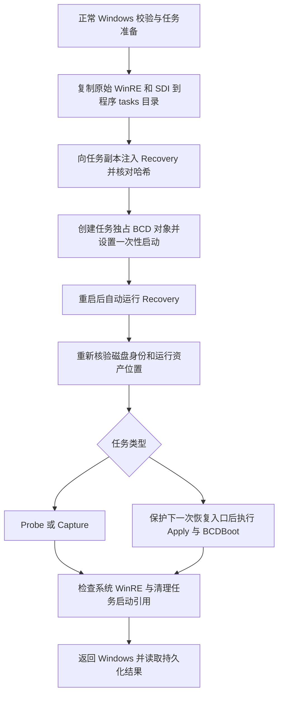

# WinRE 修复详细实施方案（2026-09-25）

文档状态：**待实施的设计方案，不是修复完成报告。**

审查基线：`9402763` / `v1.6.8`；覆盖 `b2550dc` 的静态 CRT 改动与 `9402763` 的编码、WinRE 注册位置改动。
用户本轮要求：先分析并写出详细修改方案，**不修改代码、不执行启动变更和备份还原测试**。
本轮只新增本文并更新文档索引；不修改 `VERSION`、Cargo manifest、构建脚本或程序行为。后续实际完成代码修改时再按项目规则递增版本。

## 1. 目标、证据和结论边界

### 1.1 要完成的用户流程

1. 正常 Windows 中运行程序，创建探测、备份或还原任务。
2. 经过身份、空间、镜像和启动环境校验后，一次性重启进入任务恢复环境。
3. 自动执行 Rust `Recovery.exe recover-env`，持久化记录任务状态。
4. 正确完成 Capture / Apply / BCDBoot 和恢复环境收尾，再返回 Windows。
5. 主系统、独立恢复分区和其他用户启动项不因临时测试被误改；失败有明确停留位置和恢复路径。

### 1.2 本次已经核对的事实

| 项目 | 证据与范围 |
| --- | --- |
| 宿主虚拟机版本 | 当前读取为 Parallels Desktop `26.4.2 (57518)` |
| 客体状态 | `Windows 11` 正常运行；另一台 `tiny` 未用于本轮验证 |
| WinRE 注册位置 | `harddisk0\partition4\Recovery\WindowsRE`，对应当前 C:，`reagentc /info` 为 Enabled |
| 系统分区类型 | C: 是普通 GPT Basic Data / NTFS，并非 GPT Recovery 分区 |
| 当前程序版本 | 源码和两个客体 EXE 对应 v1.6.8 |
| 程序 SHA-256 | `648590412ee7f49cbb8e7642034c29773dd707470b4e3d1bb1667de4d99dbb2b` |
| 原始 WinRE SHA-256 | `0e09f47dc74f90ac65fe8412372a77b322831da6e4d06ba087ff88da1e792ac0` |
| 本地验证 | 46 项宿主测试通过；Windows ARM64 Release 构建通过；导入表没有 VCRUNTIME / `api-ms-win-crt-*` |
| 本轮未验证 | v1.6.8 自动 WinRE probe、真实 Capture、Apply、格式化、BCDBoot 和返回 Windows |

证据保存在已忽略的 `.test-artifacts/recheck-20260925/`，以及同级 `recheck-20260925-cargo-test.log`、`recheck-20260925-build.log`。
先前测试准备创建并核验过快照 `{c91016d4-5dd0-48aa-9f4c-1bf317892c3b}`；当时尚未触发 probe 或重启。**该快照只记录当时状态，不作为后续新启动变更的通用快照。**

上述版本、哈希、磁盘位置都是本次观察值。实施前必须重新读取，不能直接把盘符或旧快照 ID 写入代码。

### 1.3 对此前结论的修正

降级记录描述了进入 Windows 恢复菜单、然后手动选择继续返回 Windows；它支持“降级及配套修复后，标准 WinRE 可以启动”。
记录还包含 NVRAM 重建、WinRE 文件重新提取、ReAgent 注册重建，因此不能称为严格单变量 A/B，不能由此证明“Parallels 升级是唯一根因”或“BackupRestore 全链路完全正常”。
Parallels 27.x 兼容性问题仍是有证据支持的嫌疑，但产品代码中的以下问题独立存在。后续若专门验证固件原因，应记录两组完整镜像、BCD、NVRAM/配置和软件版本条件，不为了补证而在当前工作环境反复升降级。

## 2. 问题到改动的对应关系

| 编号 | 问题与触发条件 | 当前代码位置 | 必须达到的结果 |
| --- | --- | --- | --- |
| F1 / P1 | WinRE 位于普通 OS 卷，且该卷被选作还原目标；格式化可能删掉当前恢复入口 | `windows_prepare.rs::recovery_identity/prepare_task`；`main.rs::format_target_partition/restore_original_winre` | 独立启动机制完成前拒绝该组合；完成后运行 WIM、SDI、任务和原始恢复资产全部位于非目标卷 |
| F2 / P1 | 程序和 WinRE 同在 C:；虽然放宽了分区类型，旧的同卷判断仍拦截 | `windows_prepare.rs::prepare_task` | 区分“真正的保留分区”和“存放 WinRE 文件的普通卷”，允许合法同卷 probe/backup |
| F3 / P2 | 从其他卷运行程序并备份存有 WinRE 的源卷；Capture 时注册 WIM 已注入当前任务 | `prepare_payload`、`recover_windows`、`build_capture_exclusions` | 备份中的系统 WinRE 保持干净；不包含当前恢复任务的启动入口、env 或可自动续跑的任务记录 |
| F4 / P2 | 使用 Windows 构建入口或直接 Cargo 构建，未继承 Mac 脚本中的静态 CRT 参数 | `build-win.sh`、`windows/build-windows.ps1` | ARM64/x64 的产品构建采用一致 CRT 策略，且以最终 EXE 导入表验证 |
| F5 / 验收口径 | 标准恢复菜单、构建成功被外推成产品恢复成功 | 降级报告、当前状态、验证矩阵 | 分别报告标准 WinRE、任务入口、Capture、Apply、返回 Windows 的证据 |

F1～F3 是已确认的代码路径缺口；本轮没有执行危险场景来复现后果。F3 的最终验收必须检查生成 WIM 内部内容，不能只看当前系统 WinRE 已恢复。

编码修复 `read_to_end + String::from_utf8_lossy` 保留。它避免非 UTF-8 本地化输出导致读取失败，但不证明挂载成功，也不替代 GUID、分区身份及超时校验。

## 3. 总体技术选择

### 3.1 分阶段实施，保留明确的安全边界

采用两段实施：

- **第一段：阻止危险组合并统一构建。** 补上 F1 拒绝条件，并暂时拒绝旧覆盖模式下“备份源 = 注册 WinRE 宿主卷”的组合，防止继续生成 F3 污染镜像；同时完善诊断、静态 CRT 和回归测试。可以独立交付，但必须明确这两种同卷任务尚不支持。
- **第二段：使用任务专用 WinRE 副本启动。** 从原始 WinRE 复制并注入到程序目录下，用独立 BCD 对象一次性启动。系统注册 WIM 不再被临时覆盖；在真实 PoC 通过后，才能开放原 WinRE 所在 OS 卷的还原。

**不能单独发布“去掉程序同卷校验”这一改动。** 如果旧的注册 WIM 覆盖模式仍在使用，开放同卷源备份会继续产生 F3。F2 的行为放宽必须与第二段的干净备份方案一同启用。

### 3.2 为什么推荐独立副本

| 方案 | 优点 | 缺口 / 决策 |
| --- | --- | --- |
| 只增加 `target != recovery` | 改动小，立即阻止危险还原 | 作为第一段保护；不能完成当前 C: WinRE 布局下的系统还原 |
| 继续覆盖注册 WIM，Capture 前再恢复原件 | 局部改动较少 | 要增加恢复、重新注入、断电续跑等事务；目标格式化问题仍存在，不作为最终方案 |
| 任务专用 WIM + SDI + 独立一次性 BCD | 原始 WinRE 保持干净，运行资产可置于非目标卷 | 推荐；必须先实测此 BCD 引导方式，不能由标准 WinRE 成功推定 |
| 自动移动程序 / 改分区 / 永久迁移 WinRE | 可能绕开当前布局 | 不采用；违反程序目录即工作目录的既定边界，也扩大操作范围 |

第二段使用系统现有 WinRE 作为镜像来源，不另造常驻 PE 桌面，不增加常规双系统菜单。
已有自定义 PE 功能保留原产品定位；新任务链不能直接复用其共享 `{ramdiskoptions}` 的写法。

### 3.3 新流程示意



## 4. 卷身份、注册路径与校验模型

### 4.1 引入明确的恢复位置模型

在 `backuprestore-core` 定义可序列化的 `WinreLocation`，Windows 查询实现放在 CLI 的新模块 `winre_location.rs`。以下名称是拟新增接口，不是当前已有 API：

| 字段 | 内容 / 约束 |
| --- | --- |
| `volume` | 现有 `VolumeIdentity`；包含磁盘/分区 GUID、几何位置、文件系统与卷身份 |
| `relativeDirectory` | 从实际注册位置解析的卷内目录；禁止硬编码 `\Recovery\WindowsRE` |
| `wimRelativePath` | 上述目录中的 WinRE WIM 路径，必须指向已验证的本地文件 |
| `sdiLocation` | BCD 实际引用的 SDI 所在卷及相对路径；不能假定与 WIM 相邻 |
| `osLoaderId/recoveryLoaderId/ramdiskOptionsId` | 经枚举验证的对象 ID；必须区分 osloader 和设备选项对象 |
| `registrationEnabled` | 实际读取的 WinRE 状态，不以路径存在代替 |
| `hostingKind` | `dedicated-recovery` 或 `ordinary-ntfs`；保留分区判定仍由 GPT 类型决定 |

`query_registered_winre()` 替代只返回卷身份的 `recovery_identity()`：

1. 读取 `reagentc /info`，从已识别的设备路径解析磁盘、分区和剩余目录；兼容中文/英文输出。
2. 按磁盘与分区 GUID 获取稳定身份，确认挂载后的真实身份。盘符只是访问路径。
3. 交叉核对当前 Windows 的 `recoverysequence`、目标 osloader 的 WIM 与 SDI 引用；不能拿“第一个大括号 GUID”直接当启动项。
4. 路径规范化后拒绝 `..`、ADS、UNC、卷根逃逸、控制字符及指向预期目录外的重解析点。
5. 核验文件存在、大小、WIM 架构及可读性。未知/禁用/不一致状态在启动修改前明确拒绝。
6. 查询和挂载工具有超时，临时盘符按所有权释放；失败不能继续使用上次缓存。

不宣称支持任意 Windows 注册形态。未覆盖的挂载目录、路径或文件系统明确报错并记录实际值，不能悄悄套默认路径。

### 4.2 同卷规则

CLI 的准备层和 WinRE 的执行层都使用核心库中的同一套纯校验函数，建议名为 `validate_volume_roles()`。
GUI 提前提示，CLI/WinRE 仍是权威校验，不能只依赖 GUI。

| 条件 | 第一段 | 第二段通过验收后 |
| --- | --- | --- |
| 程序、镜像或目标在真实 EFI/MSR/Recovery 保留分区 | 拒绝 | 拒绝 |
| 还原目标 = 程序 / 任务目录卷 | 拒绝，提示手动移动整个程序目录 | 仍拒绝，不自动复制程序 |
| 还原目标 = 镜像卷 | 拒绝 | 仍拒绝 |
| 备份源 = 镜像卷 | 拒绝 | 仍拒绝 |
| 备份源 = 注册 WinRE 宿主卷 | 旧覆盖模式暂时拒绝，防止 F3 | 独立 WIM 启动与内容抽检通过后允许 |
| 程序卷 = 普通 NTFS 的 WinRE 宿主卷 | 不单独放宽备份行为 | 允许 probe/backup；还原另按目标规则校验 |
| 镜像卷 = 普通 NTFS 的 WinRE 宿主卷 | 不把它伪装成 GPT 保留分区 | 可允许，但不能等于备份源或还原目标 |
| 还原目标 = 系统原 WinRE 宿主卷 | 必须拒绝 | 仅独立任务启动、原恢复资产保护和离线重新注册均通过时允许 |
| 还原目标 = 实际启动 WIM / SDI / 原件备份所在卷 | 拒绝 | 仍拒绝 |

第一段新增错误码建议为 `RestoreTargetHostsRegisteredWinre`，提示“当前恢复环境位于还原目标上，尚不能安全执行”；不要只提示“把程序移走”，因为移走程序并不会自动修复启动资产位置。

### 4.3 WinRE 中再次校验

在 `recover-env` 读取并核验 manifest 后、首次格式化或 Capture 前执行：

- 核验任务根、实际运行 EXE、任务 WIM/SDI 和镜像哈希与 manifest 一致。
- 用稳定分区身份重新解析所有角色，校验大小、偏移、分区类型、文件系统和加密状态。
- 按已验证分区缓存挂载结果；同卷角色复用已核验挂载，不盲目重复占用 T:/R:/S:。
- 首选盘符被其他卷占用时不覆盖；可依次查询有限候选盘符，所有查询保留超时与“未知即拒绝”。
- 第一段执行层也必须拒绝 `target == registeredWinre.volume`，防止旧任务绕过准备层。
- 第二段的格式化后序列号变化只允许发生在指定目标卷；磁盘 GUID、分区 GUID、偏移和大小仍须吻合。重新取得当前卷标识，不向旧盘符无条件写回。

## 5. 任务格式、文件布局与版本隔离

### 5.1 拟新增的数据结构

保留现有 `BootMode` 表示“返回已有系统 / 新增第二系统”；另加 `RecoveryBootStrategy` 表示恢复入口，不复用同一枚举承载两种概念。

新策略：`task-wim-one-time`。历史缺字段的任务识别为 `legacy-registered-wim`，**只能按明确的旧任务收尾规则处理，不能默认升级成新策略并自动重启。**

`Task` 增加：`recoveryBoot`、`registeredWinre`、`captureExclusions`（有需要时）与独立的新任务 schema 版本。
`PayloadManifest` 增加：任务 WIM、SDI、注册基线、启动计划、排除规则的摘要。字段必须注明哈希覆盖对象，避免 manifest 自引用。

启动对象 GUID 先分配并写入不可变计划，再写任务 env、任务快照和 WIM；实际 BCD 创建在哈希固定之后进行。
这样启动 GUID 不需要事后回写已注入 WIM 的 `task.json`，避免再次出现载荷任务与工作目录任务不一致。

### 5.2 建议任务布局

```text
<程序目录>/tasks/<task-id>/
  task.json / status.json / manifest.json
  boot-plan.json                 # 不可变：计划对象 ID、卷身份和卷内路径
  boot-transaction.json          # 可变：每一步已执行/已回滚记录
  payload/                       # Recovery.exe、env、task、内嵌 shell
  boot/Winre.wim                 # 最终用于引导的任务 WIM
  boot/boot.sdi                  # 已验证的独立 SDI 副本
  original/Winre.wim             # 原系统干净 WIM，必须在非还原目标卷
  original/boot.sdi
  original/registration.json     # 语义注册信息、原路径、基线摘要
  original/ReAgent.xml           # 若存在：仅作诊断/同系统回滚，禁止盲目写回新系统
  bcd-before-raw / bcd-before-export
  prepare.log / recovery.log / Recovery-early.log
  cleanup.json / returned-windows.json
```

所有任务数据仍在程序目录内；不引入用户填写的 TaskDrive，不自动迁移应用。
空间预检按实际拷贝次数、最大挂载/提交临时空间和安全余量计算，不能沿用仅“两份 WIM”的固定估算。
检测文件系统可启动性、压缩/EFS/BitLocker 访问条件，缺少 SDI 或引导可读性证据就拒绝，不自动联网下载工具。

### 5.3 历史任务处理

1. 已终态任务继续只读展示；不要因升级清除历史日志或快照。
2. 未完成旧任务先检查是否仍有挂载 WIM、是否修改过系统 WinRE、是否留下启动引用。
3. 新程序禁止静默续跑旧格式的破坏性任务；展示任务 ID、阶段和恢复资产位置。
4. 仅在身份和原始哈希可证实时执行旧 WinRE 修复/解除本项目启动引用，且真实 VM 操作仍先建新快照。
5. 旧格式转换不得仅改 `version` 或补策略字段；必须重新生成整个载荷并重新验收。

## 6. 一次性 BCD 启动事务

### 6.1 模块和边界

新增 CLI 模块 `task_boot.rs`，集中实现：`prepare_task_boot_plan()`、`install_task_boot_entries()`、`verify_task_boot_entries()`、`arm_task_boot_once()`、`cleanup_task_boot_entries()`。
核心库定义纯数据与计划校验，真实 BCD I/O 留在 Windows 模块。

重要约束：

- 指向当前系统实际 ESP 的 BCD，核验磁盘/分区身份；已有 `--test-efi-drive` 只用于显式隔离测试。
- 为每个任务创建独占 osloader 与设备选项对象；不改共享 `{ramdiskoptions}`、既有 WinRE recoverysequence 或正常 Windows 默认项。
- 不把设备选项对象作为 bootsequence 目标；目标必须是核验过的 osloader。
- osloader 的 WIM 与其 SDI 引用都指向 `boot/` 下的受保护文件。
- 正常任务不加入永久 `displayorder`，不改变菜单超时；一旦发现已有其他一次性启动请求，在覆盖前拒绝并提示冲突。
- 使用 Rust `Command` 参数数组调用工具，不用字符串拼接的 shell 命令处理路径、菜单名或 GUID。

现有 `native_gui.rs::install_pe_ramdisk()` 会修改共享 `{ramdiskoptions}`，不能整段挪作此模块实现。
可以复用已验证的字节解码和 GUID 解析基础，但独立设备对象创建、对象类型查询、路径回读必须重新实现并验证。

### 6.2 创建顺序

1. 完成所有读校验、空间判断、任务目录创建和 Windows/WinRE 基线记录。
2. 保存当前真实 ESP 的逻辑及原始 BCD 备份；记录已有 default、displayorder、bootsequence 的语义状态。
3. 生成任务 GUID 与两个预定 BCD 对象 ID，写不可变 `boot-plan.json`。
4. 从干净系统 WinRE 构造任务副本，注入直接 Rust 启动入口；提交后重新读取并验证 WIM 内部载荷。
5. 哈希、env、manifest、任务状态全部持久化。`--no-reboot` 在这里结束，**不创建 BCD 对象、不设置 bootsequence、不替换注册 WIM**。
6. 创建任务独占设备选项和 osloader。每一步先记录“准备执行”的意图，执行后回读确认并记录完成，允许崩溃后对账。
7. 枚举确认对象类型、`device/osdevice`、SDI 路径、`winload.efi`、`systemroot`、`winpe` 等属性及实际文件身份。
8. 确认任务对象创建没有改坏正常系统 default、displayorder、timeout、既有 recoverysequence。
9. 设置只包含本任务 osloader 的一次性请求；回读 GUID 后持久化 `boot-requested`，最后发出重启。

独立设备选项对象应使用受支持的 BCD 设备对象接口；不能再尝试把 `/application ramdisk` 当正确语法。
**具体工具参数必须在复制的离线 BCD 存储中完成创建/枚举/删除 PoC，再在新快照中验证启动。** 如果 CLI 在目标系统上不支持所需对象操作，阶段停在拒绝状态；不能退回共享设备对象或永久改 default 的捷径。

### 6.3 回滚、并发与残留

| 失败位置 | 处理 |
| --- | --- |
| 创建任务副本前/中 | 保留错误日志；释放本次挂载；系统注册 WIM、BCD 未被任务修改 |
| 仅创建了设备选项对象 | 根据预定 ID 与属性确认所有权后删除该对象；不碰同名但不同 ID 的对象 |
| osloader 已创建，未重启 | 删除本任务对象，恢复本任务改变的 bootsequence 部分并回读确认 |
| 设置一次性请求或记录状态失败 | 先撤回本任务请求，核验正常启动引用；撤回未成功就禁止重启 |
| 清理时出现别人的新启动请求 | 不执行全局 `deletevalue bootsequence`；保留对方请求并报告冲突 |
| BCDBoot 已修改正常系统项 | 按备份/单系统/第二系统各自的预期状态核验；不直接导入旧整库覆盖成功还原后的配置 |
| BCD 损坏且所有权无法判定 | 保留任务与原始备份，停止自动操作，给出明确修复证据和快照回退入口 |

用跨进程锁限制本程序同时只修改一个系统 BCD；每次关键写入前重新核对外部变更。
锁不能阻止 Windows 更新或其他工具改 BCD，因此仅依赖进程锁不足以保证安全。
正常清理采取对象级差异撤回；原始整库回滚仅适用于已验证允许回滚的失败事务，不作为任何时刻的默认清理手段。

### 6.4 断电恢复入口

一次性 bootsequence 被消费后，若格式化系统卷期间断电，旧 Windows 已不能启动。仅保留磁盘上的任务 WIM 不足以保证能够再次进入它。

因此，在独立恢复环境中、任何目标擦除前：

1. 再次确认任务启动 WIM、SDI、任务与原件都不在目标卷。
2. 在系统 ESP 为**下一次意外启动**预置本任务的一次性请求，并回读验证；失败则不格式化。
3. 使用持久化阶段和重试计数避免重复擦除错误目标；每次恢复环境重新进入后重新核验入口保护。
4. 仅在 Apply、正常 Windows 引导修复、系统 WinRE 注册及收尾均成功后撤销本任务请求，转向正常 Windows。
5. 相同阶段连续无法推进时留在恢复界面展示错误，不自行无限重启。目标已擦除时，不把“自动回 Windows”当安全退路。

BCDBoot 和离线 WinRE 注册也可能改变 BCD；调用前后都要核对任务对象和保护请求，必要时在继续下一步前重新建立并验证。工具内部写入期间断电是否保留可用 BCD，必须单独实测，不能承诺任意指令时刻断电均可恢复；该窗口验证不通过时，保留快照/外部恢复介质路径并明确未通过的故障范围。

这仍属于一次完整应用启动事务；其全部自动子步骤应记录在原事务中。进入 PE 后另行手动修改或手动返回，是新的操作，必须另建快照。

## 7. 干净备份与原 WinRE 的处理

### 7.1 Capture 的确定性规则

第二段不再覆盖系统注册的 WinRE：注入只发生在任务 `boot/Winre.wim`，因此正常 Capture 能读取干净系统文件。
Capture 前核对原注册 WIM 的哈希仍与准备基线一致；若发现更新或其他程序改动，停止并重新准备，不能覆盖外部更新来“恢复一致”。

当源卷也包含程序目录时，生成任务专用排除规则：

- 排除该程序目录内、确认归本项目所有的 `tasks/`、挂载临时目录和本次可自动恢复的状态入口（例如 `last-task.json`）。
- 路径必须先转换为源卷相对路径并校验范围；只排除明确的项目路径，不以通配符排除全部用户目录或整个 `Recovery`。
- 程序 EXE、普通用户文件和干净系统 WinRE 保留。排除清单持久化到任务和备份元数据以供解释。
- 程序在卷根时仍只排除明确生成目录/文件，禁止把源卷根当作排除项。
- Capture 中发生文件变化或失败时沿用 `.partial` / append-candidate 原子发布，不能让失败候选覆盖已有有效镜像。

### 7.2 备份验收不能只检查输出文件存在

每次验收从生成 WIM 的指定 index 提取或只读挂载并核对：

1. 注册位置对应的 WinRE SHA-256 等于备份前干净原件。
2. 该内部 WinRE 不带本次 `RecoveryTask.env`、任务 ID 或项目注入 shell；使用原件哈希作主要依据，避免误判 OEM 文件。
3. 镜像里不存在被排除的本项目活动任务与自动续跑入口。
4. 代表性 Windows 文件、用户 fixture 文件的内容与相对路径完整；元数据、WIM 索引与外部哈希一致。
5. 若第三方镜像或既有系统原件本来已经被旧项目任务注入，先阻止将其作为“干净基线”，用已验证原件或受控修复建立基线。

## 8. 还原后的系统 WinRE 和收尾

### 8.1 目标不包含原 WinRE

Probe、backup 和还原其他卷时，系统注册 WIM/SDI/注册关系应保持原样。
新策略的清理函数只核验原始资产、清除任务启动引用和登记待清理文件，不再无条件调用 `restore_original_winre()` 覆盖注册 WIM。

### 8.2 目标包含原 WinRE

只有完成以下能力后才能放开 F1 限制：

1. 格式化前把干净 WinRE、实际引用的 SDI、注册语义和必要原件备份到程序任务目录；再次证明该目录不在目标卷。
2. 从独立 WIM 执行格式化和 Apply，真实运行环境不依赖目标卷文件。
3. 按不可变分区身份重新定位已格式化目标；允许该目标出现预期卷序列号变化，不允许磁盘/分区被替换。
4. 确认目标 Windows 文件存在并取得其真实 OS loader GUID，完成 BCDBoot 与目标绑定校验。
5. 建立受验证的系统 WinRE 目标目录；以临时文件、刷新、原子替换和哈希核对写入干净 WIM/SDI。不能继续用“父目录不存在就失败”的旧收尾实现。
6. 对还原后的 Windows 重建匹配的 WinRE 注册，而不是盲目覆盖旧 `ReAgent.xml` 或直接复制旧 BCD GUID。
7. 回读离线注册与 BCD 引用，确认它们指向目标系统、正确 WIM/SDI 和正确分区。返回 Windows 后再读一次在线 `reagentc /info`。

离线注册拟采用 `reagentc` 的离线目标设置与目标 OS GUID 启用能力；具体参数、WinRE 中工具可用性、Windows 10/11 和 ARM64/x64 差异，必须先在隔离镜像/快照中验证。
**此能力未通过时，目标同卷还原保持拒绝；不能把它降级为“Apply 成功，注册以后再说”。**
恢复镜像中的 OS 与原系统版本/架构变化时，预检须判断保存的 WinRE 是否适配；不明确适配的组合拒绝，不能强行塞回旧恢复镜像。

### 8.3 失败与成功状态

建议把执行阶段和清理阶段分开持久化：现有 `Stage` 管理 Capture/Apply，另用 `cleanup.json` 记录 `pending/in-progress/complete/failed`、启动对象、原件处理及错误。
继续约束：**数据操作完成但清理失败，不写 `success`。**

- 清理失败保留所有原件、启动副本与日志，暂停自动删除；GUI 能区分“数据已写入，恢复环境收尾失败”和“数据未开始”。
- 清理可重复执行；先核验目标和所有权，再执行尚未完成的步骤。
- 不在 WinRE 仍运行且 BCD 仍引用任务 WIM 时删除启动资产；正常 Windows 确认返回后再按保留策略回收。
- `success` 表示任务执行和预定清理通过，不虚构已观察到后续 Windows 启动。`returned-windows.json` 由下次正常 GUI 启动或测试验收入口写入，记录任务 ID、系统启动时间、分区身份和注册检查结果。
- 端到端“通过”必须同时有 WinRE 持久化日志及返回 Windows 证据；CLI 退出码 0、截图或进程存在单独都不足够。

原 `WinreRestoreGuard` 改为按策略工作的 `RecoveryCleanupGuard`；析构只作最后一次尽力清理，不能承担关键错误上报与成功判定。
新策略严禁因析构无条件写回旧系统 WIM；旧策略的修复只能在其原件、身份和修改所有权核验后执行。

## 9. 静态 CRT、构建和载荷审计

### 9.1 统一配置

拟新增 `.cargo/config.toml`，对 Windows MSVC 目标统一配置 `-C target-feature=+crt-static`。macOS/Linux 宿主不受影响。

构建入口调整：

| 文件 | 具体改动 |
| --- | --- |
| `build-win.sh` | 显式使用仓库 Cargo 配置；SDK / LIBPATH 参数按目标追加，不用覆盖整个 `RUSTFLAGS` 的方式抹掉公共配置 |
| `windows/build-windows.ps1` | 从任何 cwd 执行都显式加载仓库配置；不能以为 `--manifest-path` 自动加载该仓库 `.cargo/config.toml`；使用 `try/finally` 恢复临时环境和 cwd |
| CLI 编译入口 | 对 Windows MSVC 且未启用 `crt-static` 的产品构建增加明确编译错误，防外部 `RUSTFLAGS/CARGO_ENCODED_RUSTFLAGS` 覆盖后静默产出动态包 |
| CI | 保留宿主规则测试与 Windows 类型检查，新增具备 SDK 的实际 Windows 构建和产物导入检查；无 ARM64 runner 时明确只完成交叉构建 |

调用者设置的 linker、SDK、其他 RUSTFLAGS 不应被悄悄丢弃。优先显式合并；冲突无法消解时清楚报错，不能输出成功包。
在不同工作目录及设置了外部编译标志的环境中回归，防止只有开发者常用终端能构建正确。

### 9.2 最终产物检查

新增 `scripts/verify-pe-runtime.py` 或等价离线工具，解析 PE 普通导入和延迟导入，至少拒绝：

- `VCRUNTIME*.dll`、`MSVCP*.dll`；
- `ucrtbase.dll`、`api-ms-win-crt-*`；
- 架构与打包目录/manifest 不一致，或入口 EXE 与 Recovery.exe 内容不一致。

该检查只证明没有这些外部 CRT 依赖，**不把结果写成“零 DLL 依赖”**。程序仍依赖系统 Win32 DLL，API Set 也不能按磁盘上有没有同名文件判断是否可用。
实际 WinRE 启动仍是独立验收项。

Windows 打包不再强制从 System32/SysWOW64 拷贝 VC runtime；静态包不因宿主没安装 VC runtime 而失败。
删除这一要求前先用最终 EXE 审计验证；旧动态包只读诊断，不伪装成新静态包。
`winre_payload.rs` 的可选运行库逻辑分阶段处理：兼容旧诊断可保留，但新任务 manifest 必须明确静态策略；包里残留动态 DLL 不能成为掩盖构建错误的兜底。

### 9.3 编码与超时回归

保留 lossy 解码，同时给 `text_parsing.rs` 增加字节级入口及严格 GUID 行识别：

- 中文 OEM/GBK 错误字节不触发 UTF-8 异常；日志可替换解码。
- 成功但只有无关文本或空输出，返回 Unknown；不能把任意首个非空行当卷 GUID。
- 合法 ASCII 卷 GUID 周围存在本地化文本，仍能精确提取唯一匹配。
- 多个冲突 GUID、超时、子进程异常都拒绝挂载；不得解释为“空盘符”。
- 非零退出的未挂载判定需有明确规则和分配后的身份复核；对权限/未知错误保守处理。

保留现有查询、分配和 diskpart 的超时、子进程终止与日志；不恢复无边界的盘符全扫描，也不以长时间 sleep 掩盖失败。

## 10. 文件与函数实施清单

| 文件 / 模块 | 拟修改内容 | 主要验收 |
| --- | --- | --- |
| `crates/backuprestore-core/src/lib.rs` | WinreLocation、策略、角色校验、任务/manifest schema、排除规则和清理数据模型 | 纯逻辑、序列化与非法状态测试 |
| `crates/backuprestore-cli/src/winre_location.rs`（新增） | 注册查询、实际路径解析、WIM/SDI 与 BCD 交叉校验 | 中文/英文 fixture + Windows 只读查询 |
| `crates/backuprestore-cli/src/task_boot.rs`（新增） | 独占启动对象、事务日志、一次性请求、断电保护、对象级清理 | 离线 BCD PoC、失败回滚、真实自动 probe |
| `windows_prepare.rs::prepare_task` | 统一同卷规则、首段阻止目标覆盖原 WinRE、策略分支 | CLI/GUI 一致的拒绝及允许矩阵 |
| `windows_prepare.rs::prepare_payload` | 只注入任务副本，SDI/原件保护、内容审计，`--no-reboot` 不改活动启动配置 | 原件 hash 和 BCD 语义前后一致 |
| `windows_prepare.rs::write_recovery_env` | 真实卷内路径、启动策略与计划 ID；避免与已注入任务产生差异 | env/manifest/task 一致性 |
| `main.rs::recover_env/mount_env_volume` | 角色复用、执行前二次校验、新旧策略分流、目标重格式化后重新定位 | 换盘符、身份篡改、同卷角色用例 |
| `main.rs::recover_windows` | Capture 排除、擦除前恢复入口保护、Apply 后 WinRE 注册 | WIM 内容检查、断电和实际系统引导 |
| `main.rs::restore_original_winre/WinreRestoreGuard` | 改为策略感知的显式收尾；拒绝无条件覆盖注册原件 | 原件变化、父目录缺失、清理失败重试 |
| `main.rs::resume_pending_boot_task` | 按任务策略和哈希重建/确认任务入口，不能仍只调用 `reagentc /boottore` | 新任务续跑、旧任务阻止、重试熔断 |
| `native_gui.rs` | 提前显示真实不支持原因、清理结果、旧任务状态；删除无证据的固件/真机保证文案 | 已安装程序真实可见行为 |
| `text_parsing.rs` | 非 UTF-8 字节、合法 GUID 和未知状态分类 | 有边界的解析测试 |
| 构建脚本、Cargo 配置、CI | 静态 CRT、防覆盖、实际链接和 PE 检查 | ARM64/x64 产物与干净环境启动 |

不把自定义 PE 桌面的磁盘写入执行器纳入本次重构；如共享底层代码，先证明不会改变其现有行为再复用。

## 11. 实施顺序与逐阶段退出条件

| 阶段 | 工作 | 可交付结果 / 不能声称的内容 |
| --- | --- | --- |
| S0 | 重新读取仓库/VM、原件哈希和当前任务；保护用户基线 | 得到当前事实；不能复用旧快照覆盖新动作 |
| S1 | 目标=原 WinRE 卷的双层拒绝、旧覆盖模式同卷备份拒绝、CRT 统一、编码解析测试、诊断文案 | 安全补丁；上述同卷备份/还原组合仍拒绝 |
| S2 | WinreLocation 与任务 schema、注册查询、旧任务隔离 | 可解释真实路径与能力；未改变启动策略 |
| S3 | 独立任务 WIM/SDI 和 BCD PoC；先离线存储，再实际非破坏 probe | 只有真实自动 probe 成功才进入下一阶段 |
| S4 | 启用普通卷同卷 probe/backup、精确排除与 WIM 内容验收 | 解决 F2/F3；未通过内容检查不发布备份成功结论 |
| S5 | 还原前入口保护、原件保护、Apply 后离线注册、分阶段故障注入 | 完整通过后才开放目标=原 WinRE 卷 |
| S6 | GUI 回归、第二系统回归、文档同步、版本与打包交付 | 逐项列出架构和实测边界，不外推真机/x64 |

每个完成的代码交付轮次按十进制进位 `+0.0.1`，同步版本文件、Cargo 与包 manifest；不能在方案里预先把未实施阶段标为发布版本。
开发中间提交允许存在，但不得把半实现的同卷还原作为默认可用能力。

## 12. 测试矩阵与通过标准

### 12.1 离线和构建层

| ID | 场景 | 必须断言 |
| --- | --- | --- |
| U01 | 真 Recovery/EFI/MSR 与普通 NTFS 承载 WinRE | 分类正确；保留分区限制不能随 F2 放宽 |
| U02 | 程序、源、镜像、目标、注册 WinRE、任务启动卷组合 | 所有允许/拒绝分支，特别是目标=启动资产、程序=目标 |
| U03 | 实际注册路径、中文输出、自定义目录、SDI 异卷 | 正确解析；坏路径、多义 GUID、对象类型不符拒绝 |
| U04 | 启动计划与 immutable payload | 计划 GUID 提前固定；task/env/manifest 不发生回写漂移 |
| U05 | 旧格式任务、缺失策略/哈希、篡改 env | 不自动进行破坏性续跑；错误可读 |
| U06 | 非 UTF-8 mountvol、空输出、无关文本、多 GUID、超时 | 不崩溃、不误当空盘符、不绕过身份检查 |
| U07 | 排除路径含空格/中文、程序在卷根、目录重解析 | 只排除项目生成内容；不能排除用户数据/整个源卷 |
| U08 | 每个 BCD 写入点前后崩溃 | 事务对账可重复；只撤销自己创建的对象和请求 |
| B01 | Mac 交叉构建 / Windows ARM64 / Windows x64 | 实际链接成功，EXE machine、静态 CRT、哈希与 manifest 一致 |
| B02 | 不同 cwd、外部 RUSTFLAGS、缺少 VC runtime 的构建机 | 公共配置有效；冲突失败明确；不依赖手动终端环境 |

按仓库现有命令执行 fmt、宿主测试、Clippy 和运行时边界检查；Windows-only 单元逻辑需要 Windows 目标编译和客体执行。
`cargo check/clippy --target` 只证明类型检查，不能代替 Windows 测试运行或 WinRE 启动。

### 12.2 Windows / WinRE 实机层

| ID | 场景 | 最小通过证据 |
| --- | --- | --- |
| W01 | 程序 C:、WinRE C:，`probe --no-reboot` | 准备通过；活动 BCD、注册 WIM/SDI 哈希未改；没有重启 |
| W02 | 原 WinRE 在独立分区，真实自动 probe | 任务 ID 对应的 Recovery 日志、终态与返回 Windows 证据 |
| W03 | 原 WinRE 在普通 OS 卷，真实独立 WIM probe | 同上；证明新 BCD 方式实际可启动，不是标准恢复菜单替代 |
| W04 | 首段仍使用旧策略，目标或备份源=WinRE 宿主 | Windows 与 WinRE 均在业务磁盘写入前拒绝；目标 hash 未变、不产出污染备份 |
| W05 | 程序=备份源，WinRE=备份源 | Capture 成功；生成 WIM 的内部 WinRE hash 干净、项目任务被正确排除 |
| W06 | 程序不在源卷，WinRE=备份源 | 干净 Capture；与 W05 验证同一资产保护规则 |
| W07 | 用户提供的无 Recovery 目录系统镜像还原 | 隔离目标重建目录、WIM/SDI、注册、BCDBoot、实际返回系统均通过 |
| W08 | 原 WinRE 所在目标卷被还原 | 运行资产确在其他卷；还原后系统可启动，WinRE 再次可进入 |
| W09 | 正常旧独立 Recovery 分区场景 | 不因新方案回归；注册文件与其他启动项保持预期 |
| W10 | 第二系统还原 | 原主系统默认启动保持；新增系统实际可启动；两个系统的恢复配置不串用 |
| W11 | Windows GUI 真实操作 | 允许/拒绝提示、备份/还原进度、清理错误、结果刷新与 CLI 一致 |
| W12 | 静态 CRT 的 ARM64/x64 干净 WinRE | 各自架构实际运行 Recovery；不能由 ARM64 的成功勾选 x64 |

本轮指定测试 VM 当前的 C: 是用户正常 Windows 基线。本文的“OS 卷同卷还原”用例优先在新建的隔离克隆/专用 fixture 中构造；**本文不是格式化当前 C: 的授权**。
fixture 的创建、分区布局和磁盘 GUID 必须先确认，不能直接套用历史 P/Q/H 或当前 C/E 的盘符。

### 12.3 故障注入

| ID | 注入点 | 必须保持的性质 |
| --- | --- | --- |
| X01 | 任务 WIM/SDI 缺失、哈希不符、架构错误 | 启动前失败，无新的有效启动请求 |
| X02 | BCD 创建设备对象后、osloader 后、bootsequence 后 | 恢复时可对账，不残留未知启动引用，不影响别人 |
| X03 | WinRE 挂载超时/盘符被占/身份被替换 | 不覆盖盘符、不格式化，日志含阶段和身份差异 |
| X04 | Capture 中断、追加候选满盘、原 WinRE 被外部改变 | 原已有镜像不损坏；拒绝把变化当作原始基线 |
| X05 | 目标已擦除、镜像应用中、BCDBoot 前后断电 | 下一次可进入受保护任务环境；阶段续跑不依赖已擦除目标里的程序 |
| X06 | 系统 WinRE 写回/离线注册失败 | 不标 success、不清理恢复入口；可以明确重试收尾 |
| X07 | 清理期间出现外部 bootsequence / BCD 更新 | 不删除对方请求、不整库覆盖新配置 |
| X08 | 状态写入、撤回启动请求、重启调用失败 | 持久化结果如实反映；不依赖 Drop 吞错后报成功 |
| X09 | 同一任务同一阶段反复重入 | 有熔断和人工恢复界面，不无限重启；已擦除目标不自动回退坏系统 |

故障实验的成功标准是预期安全状态和恢复能力；不能要求所有故障都出现 `success`，也不能把“写了 failed”当作启动资产已修复。

### 12.4 快照与最小证据

每次手动修改 BCD、默认项、一次性启动、WinRE 注册、PE/任务引导部署前，创建并核验新 Parallels 快照。
每次触发完整应用启动变更事务前也单独创建快照；失败立即停止该操作，不复用旧快照。进入 PE 后的新手动动作另建快照。

每个场景保留：

- 版本、commit、二进制哈希、VM/客体架构、快照 ID、目的和变更范围；
- 前后 WinRE WIM/SDI 哈希、注册语义、BCD 关键引用、任务 manifest 与最终状态；
- 最小 `prepare.log` / `recovery.log` / 早期挂载日志、WIM 内容抽检结果；
- 必要的裁剪压缩截图、返回 Windows 的启动时间和系统身份记录。

原始证据留在 `.test-artifacts/`，对外传递只使用压缩后的必要内容。不删除用户文件、系统恢复原件、开发工具链或现有快照。

## 13. 文档、交付与最终验收

代码实施后同步：

| 文档 | 需要写明 |
| --- | --- |
| `project-status.md` | 当前实际版本、已完成阶段、仍拒绝的布局和下一项实测 |
| `current-status-2026-09-16.md` 或新的当前基线 | 新旧任务策略、当前真实验证边界，并由索引指向唯一当前入口 |
| `verification-matrix.md` / `testing-plan.md` | 用例 ID、架构、版本、任务 ID、证据位置和通过/未测状态 |
| `winre-payload-contract-2026-09-16.md` | 独立 WIM、SDI、不可变计划、env/manifest 一致性和清理责任 |
| `windows-build.md` / CRT 记录 | 所有构建入口的参数来源、配置优先级、PE 导入检查与执行命令 |
| 降级故障报告 | 更正“唯一根因”“完全正常”“真机不受影响”等超出证据的表述，保留原历史事实 |

最终交付必须分别回答：

1. 当前布局是否能创建任务并自动进入 Recovery？
2. 生成的备份是否包含干净 WinRE，且没有本次任务残留？
3. 目标卷同时承载原 WinRE 时，是否有独立入口、断电恢复路径和正确重新注册？
4. 还原后的 Windows 及其 WinRE 是否都真实启动过？
5. ARM64/x64、正常与故障场景分别有哪些证据，哪些仍未覆盖？

只在对应实机证据齐备后勾选完成。若独立 BCD 或离线 WinRE 注册 PoC 失败，保留第一段安全拒绝，明确报告阻塞条件；不得放宽校验后用构建通过替代验收。

## 14. 本文档本身的验收

- [x] 只修改 Markdown 文档；无源码、构建参数、版本号或虚拟机启动变更。
- [x] 问题 F1～F5 均有实施位置、行为规则与验收项。
- [x] 独立 BCD、离线注册、断电入口均明确列为待实测能力，没有冒充已有实现。
- [x] 新旧任务、部分失败、清理和用户数据边界有明确规则。
- [x] 文档内相对链接可解析、代码围栏闭合、`git diff --check` 通过。

以上清单用于本次文档校验；第 11～12 节的代码与实机工作均未由本文执行。
